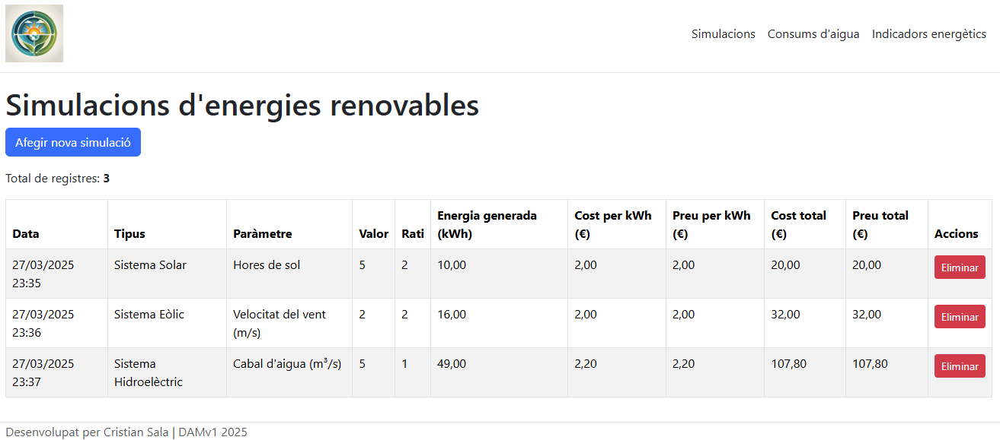
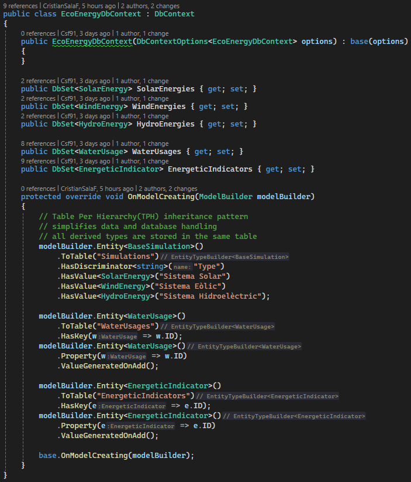
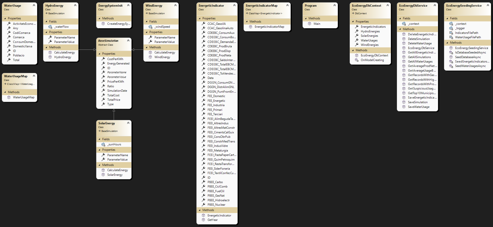
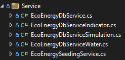

# t5-pr1-CristianSala

## Single source of truth (SSOT)

This project has been designed with the intention of having a single source of truth, 
which is the database in order to handle/store the data.

How it compares with the previous version? The previous version used to grab data from the CSV files, 
and stored it into json, csv and xml.

## Code-first approach
This approach was used for convenience, due to having done/processed the parameters for the full CSV files, before it was changed. 

This simplified the implementation for a code-first approach while also providing consistent results. A DBContext has been used to achieve this.

## User Interface
The website looks and feels exactly like in T4-PR1, however there's one change that adds to this functionality. 


In the section where all the columns are, at the end of each row there is a "Eliminar" button, 
which if clicked will prompt a popup confirmation, and upon confirmation, it will delete the selected row and refresh the page to display the updated list.

## Simulations DB implementation
The simulations class uses a string as a discriminator based on the type of object. 

This type will vary based on a controlled set of values. 

 
(Sistema Solar/Eòlic/Hidroelèctric)

## CustomMaps and [Ignore] (CSVHelper)
In order to properly map the attibutes from the CSV to the Model data, I had to ignore the "ID" field, which the aforementioned tag from CSVHelper, did help.
```c# 
public class WaterUsageMap : ClassMap<WaterUsage>
{
    public WaterUsageMap()
    {
        Map(m => m.Any).Name("Any");
        Map(m => m.CodiComarca).Name("Codi comarca");
        Map(m => m.Comarca).Name("Comarca");
        Map(m => m.Poblacio).Name("Població");
        Map(m => m.DomesticXarxa).Name("Domèstic xarxa");
        Map(m => m.ActivitatsEconomiquesIFontsPropies).Name("Activitats econòmiques i fonts pròpies");
        Map(m => m.Total).Name("Total");
        Map(m => m.ConsumDomesticPerCapita).Name("Consum domèstic per càpita");
    }
}
```
```c# 
public class WaterUsage
{
    [Key]
    [DatabaseGenerated(DatabaseGeneratedOption.Identity)]
    [Ignore]
    //this is set to null so EF Core will auto-generate the values, check SeedWaterUsagesAsync() in Services/EcoEnergySeedingService
    public int? ID { get; set; } = null;
    public int Any { get; set; }
    public int CodiComarca { get; set; }
    public string Comarca { get; set; } = string.Empty;
    public int Poblacio { get; set; }
    public int DomesticXarxa { get; set; }
    public int ActivitatsEconomiquesIFontsPropies { get; set; }
    public int Total { get; set; }
    public double ConsumDomesticPerCapita { get; set; }
}
```

Another thing i had to implement was custom ClassMap for the data reliant on the csv files (Seeding service for the first data import).

## Asynchronous seeding service
There is a registered service in Program that handles this, this is a new implementation that wasn't a part of T4-PR1 at all.
It makes use of a ILogger<EcoEnergySeedingService> which made it easier to debug.

If the database is already seeded, it prevents from doing so again to avoid duplicated data.

Also, it doesn't need any interaction from the user to work. It does that on launch because of it being a Scoped service.

## Refactor (last minute changes and optimizations)
The ClassDiagram.cd has been also updated to match the current solution.
The EcoEnergyDbService has been split using partial classes, since it acts as the CRUD manager.




### NuGet Package Manager log (Migration OK)

Create database in SqlServer management studio using: 
`create database EcoEnergyDB;`

Migration add (dotnet ef migration add InitialMigration)
```
PM> Add-Migration InitialMigration
Build started...
Build succeeded.
To undo this action, use Remove-Migration.
```

Database update (dotnet ef database update)
```
PM> Update-Database
Build started...
Build succeeded.
Microsoft.EntityFrameworkCore.Database.Command[20101]
      Executed DbCommand (22ms) [Parameters=[], CommandType='Text', CommandTimeout='30']
      SELECT 1
Microsoft.EntityFrameworkCore.Migrations[20411]
      Acquiring an exclusive lock for migration application. See https://aka.ms/efcore-docs-migrations-lock for more information if this takes too long.
Acquiring an exclusive lock for migration application. See https://aka.ms/efcore-docs-migrations-lock for more information if this takes too long.
Microsoft.EntityFrameworkCore.Database.Command[20101]
      Executed DbCommand (37ms) [Parameters=[], CommandType='Text', CommandTimeout='30']
      DECLARE @result int;
      EXEC @result = sp_getapplock @Resource = '__EFMigrationsLock', @LockOwner = 'Session', @LockMode = 'Exclusive';
      SELECT @result
Microsoft.EntityFrameworkCore.Database.Command[20101]
      Executed DbCommand (14ms) [Parameters=[], CommandType='Text', CommandTimeout='30']
      IF OBJECT_ID(N'[__EFMigrationsHistory]') IS NULL
      BEGIN
          CREATE TABLE [__EFMigrationsHistory] (
              [MigrationId] nvarchar(150) NOT NULL,
              [ProductVersion] nvarchar(32) NOT NULL,
              CONSTRAINT [PK___EFMigrationsHistory] PRIMARY KEY ([MigrationId])
          );
      END;
Microsoft.EntityFrameworkCore.Database.Command[20101]
      Executed DbCommand (1ms) [Parameters=[], CommandType='Text', CommandTimeout='30']
      SELECT 1
Microsoft.EntityFrameworkCore.Database.Command[20101]
      Executed DbCommand (1ms) [Parameters=[], CommandType='Text', CommandTimeout='30']
      SELECT OBJECT_ID(N'[__EFMigrationsHistory]');
Microsoft.EntityFrameworkCore.Database.Command[20101]
      Executed DbCommand (21ms) [Parameters=[], CommandType='Text', CommandTimeout='30']
      SELECT [MigrationId], [ProductVersion]
      FROM [__EFMigrationsHistory]
      ORDER BY [MigrationId];
Microsoft.EntityFrameworkCore.Migrations[20402]
      Applying migration '20250325195048_InitialMigration'.
Applying migration '20250325195048_InitialMigration'.
Microsoft.EntityFrameworkCore.Database.Command[20101]
      Executed DbCommand (6ms) [Parameters=[], CommandType='Text', CommandTimeout='30']
      CREATE TABLE [EnergeticIndicators] (
          [ID] int NOT NULL IDENTITY,
          [Data] nvarchar(max) NOT NULL,
          [PBEE_Hidroelectr] float NOT NULL,
          [PBEE_Carbo] float NOT NULL,
          [PBEE_GasNat] float NOT NULL,
          [PBEE_FuelOil] float NOT NULL,
          [PBEE_CiclComb] float NOT NULL,
          [PBEE_Nuclear] float NOT NULL,
          [CDEEBC_ProdBruta] float NOT NULL,
          [CDEEBC_ConsumAux] float NOT NULL,
          [CDEEBC_ProdNeta] float NOT NULL,
          [CDEEBC_ConsumBomb] float NOT NULL,
          [CDEEBC_ProdDisp] float NOT NULL,
          [CDEEBC_TotVendesXarxaCentral] float NOT NULL,
          [CDEEBC_SaldoIntercanviElectr] float NOT NULL,
          [CDEEBC_DemandaElectr] float NOT NULL,
          [CDEEBC_TotalEBCMercatRegulat] nvarchar(max) NOT NULL,
          [CDEEBC_TotalEBCMercatLliure] nvarchar(max) NOT NULL,
          [FEE_Industria] float NOT NULL,
          [FEE_Terciari] float NOT NULL,
          [FEE_Domestic] float NOT NULL,
          [FEE_Primari] float NOT NULL,
          [FEE_Energetic] float NOT NULL,
          [FEEI_ConsObrPub] float NOT NULL,
          [FEEI_SiderFoneria] float NOT NULL,
          [FEEI_Metalurgia] float NOT NULL,
          [FEEI_IndusVidre] float NOT NULL,
          [FEEI_CimentsCalGuix] float NOT NULL,
          [FEEI_AltresMatConstr] float NOT NULL,
          [FEEI_QuimPetroquim] float NOT NULL,
          [FEEI_ConstrMedTrans] float NOT NULL,
          [FEEI_RestaTransforMetal] float NOT NULL,
          [FEEI_AlimBegudaTabac] float NOT NULL,
          [FEEI_TextilConfecCuirCalcat] float NOT NULL,
          [FEEI_PastaPaperCartro] float NOT NULL,
          [FEEI_AltresIndus] float NOT NULL,
          [DGGN_PuntFrontEnagas] float NOT NULL,
          [DGGN_DistrAlimGNL] float NOT NULL,
          [DGGN_ConsumGNCentrTerm] float NOT NULL,
          [CCAC_GasolinaAuto] float NOT NULL,
          [CCAC_GasoilA] float NOT NULL,
          CONSTRAINT [PK_EnergeticIndicators] PRIMARY KEY ([ID])
      );
Microsoft.EntityFrameworkCore.Database.Command[20101]
      Executed DbCommand (5ms) [Parameters=[], CommandType='Text', CommandTimeout='30']
      CREATE TABLE [Simulations] (
          [ID] int NOT NULL IDENTITY,
          [SimulationDate] datetime2 NOT NULL,
          [Type] nvarchar(21) NOT NULL,
          [Ratio] float NOT NULL,
          [EnergyGenerated] float NOT NULL,
          [CostPerKWh] float NOT NULL,
          [PricePerKWh] float NOT NULL,
          [ParameterValue] float NOT NULL,
          CONSTRAINT [PK_Simulations] PRIMARY KEY ([ID])
      );
Microsoft.EntityFrameworkCore.Database.Command[20101]
      Executed DbCommand (4ms) [Parameters=[], CommandType='Text', CommandTimeout='30']
      CREATE TABLE [WaterUsages] (
          [ID] int NOT NULL IDENTITY,
          [Any] int NOT NULL,
          [CodiComarca] int NOT NULL,
          [Comarca] nvarchar(max) NOT NULL,
          [Poblacio] int NOT NULL,
          [DomesticXarxa] int NOT NULL,
          [ActivitatsEconomiquesIFontsPropies] int NOT NULL,
          [Total] int NOT NULL,
          [ConsumDomesticPerCapita] float NOT NULL,
          CONSTRAINT [PK_WaterUsages] PRIMARY KEY ([ID])
      );
Microsoft.EntityFrameworkCore.Database.Command[20101]
      Executed DbCommand (10ms) [Parameters=[], CommandType='Text', CommandTimeout='30']
      INSERT INTO [__EFMigrationsHistory] ([MigrationId], [ProductVersion])
      VALUES (N'20250325195048_InitialMigration', N'9.0.3');
Microsoft.EntityFrameworkCore.Database.Command[20101]
      Executed DbCommand (3ms) [Parameters=[], CommandType='Text', CommandTimeout='30']
      DECLARE @result int;
      EXEC @result = sp_releaseapplock @Resource = '__EFMigrationsLock', @LockOwner = 'Session';
      SELECT @result
Done.
```